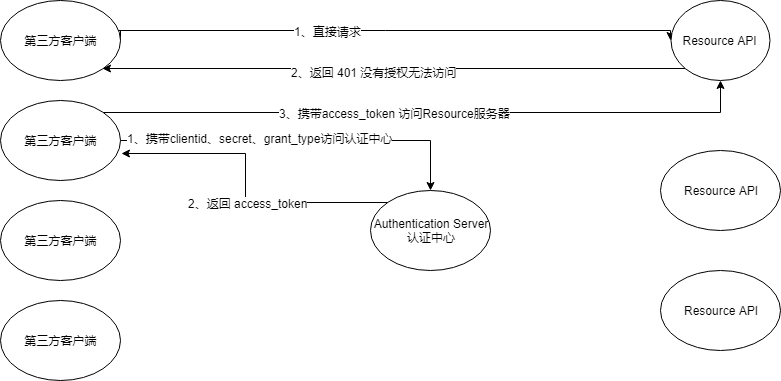
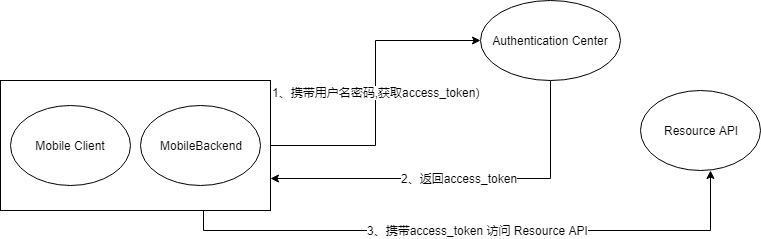
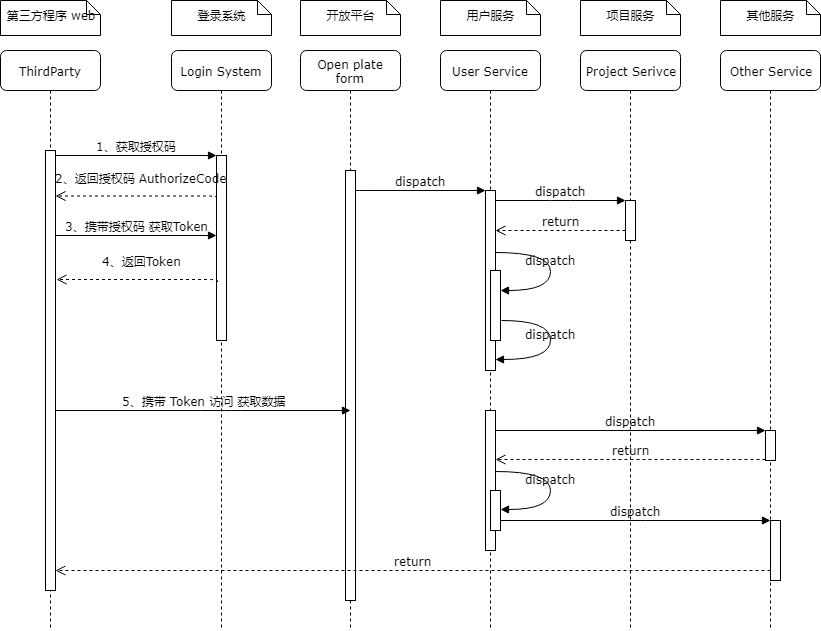

#客户端模式访问：
	
>多个ResourceAPI可以指定不同的名称，也可以给多个客户端分配不同的clientId，secret，当客户端要访问Resource服务时，需要携带各自的clientId，secret等信息。

#密码模式：
>需要指定用户名和密码，secret可以设置为不需要客户端输入，这种模式用在彼此相对信任的情况下

#授权码模式
> 如果是我们自己信任的系统，我们可以不使用授权码的模式，可以通过客户端模式或密码模式获取token然后访问各个子系统，但是如果我们是对第三方提供调用，授权码模式相对来说会更安全些。

